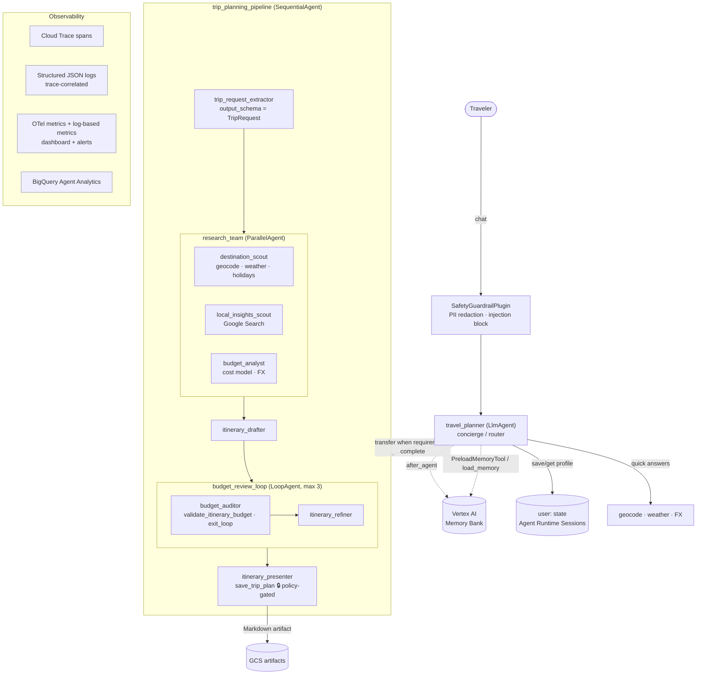

# ✈️ Wanderwise — a multi-agent Travel Planner on Google Cloud

> **Track:** Concierge Agents · **Stack:** Google ADK 2.9 · Gemini · Agent Runtime (Vertex AI Agent Engine) · Memory Bank · Cloud Trace · BigQuery · Cloud Build · Terraform
> **Scaffolded & deployed with** [`agents-cli`](https://pypi.org/project/google-agents-cli/)

## 1. The problem

Planning a trip is still a 6-10 hour chore spread across a dozen tabs: weather
sites, holiday calendars, currency converters, blogs, maps and spreadsheets to
check it all fits the budget. Generic chatbots make it worse in subtle ways:
they **invent prices and weather**, **forget who you are** between
conversations (you re-explain you're vegetarian every time), and happily
produce a "perfect" itinerary that is **30% over budget**.

## 2. The solution

**Wanderwise** is a travel concierge agent that:

| Pain | What Wanderwise does |
|---|---|
| Invented facts | Grounds every fact in a tool: live weather (Open-Meteo), public holidays (Nager.Date), ECB exchange rates (Frankfurter), Google Search for local insights |
| Blown budgets | Money math is **code, not LLM**: a deterministic cost model estimates spend, and a **critic/refiner loop** audits every itinerary against the budget until it fits — a policy gate makes it *impossible* to save an unaudited plan |
| Forgetting you | Two memory layers: a structured `user:`-scoped profile (diet, pace, currency…) **and** Vertex AI **Memory Bank** for facts learned in past conversations |
| Slow research | Destination, local-insight and budget research run **in parallel** |
| Trust & safety | PII redaction (cards/passports), prompt-injection short-circuit, off-topic refusal |

## 3. Architecture



### How the budget loop works
1. `itinerary_drafter` writes a day-by-day plan with a priced cost table.
2. `budget_auditor` sends **every line item** to `validate_itinerary_budget`
   (pure Python). If `within_budget` → it calls `exit_loop`.
3. Otherwise it emits targeted cuts (most expensive items first) and
   `itinerary_refiner` rewrites the plan. Repeat ≤ 3×.
4. `itinerary_presenter` may call `save_trip_plan` **only** if the last audit
   passed — enforced by a `before_tool_callback`, not by prompt wording.

## 4. How it maps to the evaluation criteria

### 🛠️ Tool & Interface Design
- 10 purpose-built function tools in [`app/tools/`](app/tools) with rich
  docstrings, typed args (`Literal` enums, a Pydantic `CostItem` model) and a
  **uniform contract**: `{"status": "success", ...}` or
  `{"status": "error", "error_message": "<actionable>"}`. Tools never raise.
- Shared resilient HTTP layer ([`_http.py`](app/tools/_http.py)): timeouts,
  exponential-backoff retries on 429/5xx, one OTel span per call.
- Smart fallbacks: weather uses live forecast ≤16 days out and **climate
  normals** beyond that; geocoding results are cached in session state.
- Built-ins: `google_search` (isolated in its own agent), `exit_loop`,
  `PreloadMemoryTool`, `load_memory`, artifacts.
- Structured hand-off: the pipeline's first step emits a validated
  `TripRequest` (`output_schema`), the contract every specialist consumes.
- Exposed via ADK REST/SSE, **A2A** (`/a2a/app`) and the Agent Runtime API.

### 🧠 Context & Memory
- **Short-term:** session state passes curated context between agents via
  `output_key` + `{placeholders}`; specialists run with
  `include_contents="none"` so they see only what they need (fewer tokens,
  less drift).
- **Long-term structured:** `user:traveler_profile` and `user:saved_trips`
  persist per user across sessions and are injected into the concierge's
  dynamic `InstructionProvider`.
- **Long-term semantic:** Vertex AI **Memory Bank** — the root agent's
  `after_agent_callback` asynchronously pushes each session to Memory Bank;
  `PreloadMemoryTool` retrieves relevant memories each turn.
- **Context window management:** `EventsCompactionConfig` summarises older
  turns; `ContextCacheConfig` caches the static prompt prefix.

### 🔀 Orchestration & Logic
- LLM-driven routing (concierge → pipeline transfer) only once requirements
  are complete; quick questions handled directly.
- **Sequential** → **Parallel** fan-out → **Loop** (critic/refiner) → gated
  finaliser, all native ADK workflow agents.
- Deterministic guards where correctness matters: budget math in code,
  policy gate on saving, injection short-circuit before any model call.
- Graceful degradation: `on_tool_error_callback` converts unexpected
  exceptions into recoverable tool results; model calls retry (3 attempts).

### 🔭 Observability & Tracing
- **Cloud Trace** via ADK OpenTelemetry (`GOOGLE_CLOUD_AGENT_ENGINE_ENABLE_TELEMETRY=true`),
  enriched by [`TravelTelemetryPlugin`](app/observability.py) with business
  attributes (`travel.destination`, `travel.within_budget`, cached tokens…).
- **Structured JSON logs** with `logging.googleapis.com/trace` so each log
  line links to its trace: `agent_start/end`, `tool_start/end` (latency,
  status), `llm_usage` (tokens), `guardrail_block`, `policy_block`,
  `memory_persisted`.
- **Metrics:** OTel counters/histograms + Terraform-managed log-based metrics,
  an alert policy and a Cloud Monitoring dashboard
  ([`monitoring.tf`](deployment/terraform/single-project/monitoring.tf)).
- **Analytics:** ADK `BigQueryAgentAnalyticsPlugin` streams every event to
  BigQuery (`adk_agent_analytics`) for offline analysis.
- **Quality:** `agents-cli eval` suite (9 cases: memory, tools, clarification,
  guardrails, full pipeline, budget edge case) with an LLM-as-judge travel
  rubric + a deterministic tool-error metric.

### 🏗️ Infrastructure & CI/CD
- Scaffolded with `agents-cli scaffold create` (ADK + Agent Runtime + Cloud
  Build + BigQuery analytics) and deployed with `agents-cli deploy`.
- **Terraform** for everything: service accounts/IAM, Agent Runtime, buckets,
  telemetry sinks, monitoring, and the CI/CD project
  ([`deployment/terraform`](deployment/terraform)).
- **Cloud Build** pipelines ([`.cloudbuild/`](.cloudbuild)):
  - `pr_checks.yaml` — ruff lint/format, codespell, unit tests, integration tests
  - `staging.yaml` — **eval quality gate** → deploy to staging → Locust load
    test → results to GCS → trigger prod
  - `deploy-to-prod.yaml` — manual-approval production deploy
- Container build from a public, hash-pinned `uv.lock`.

## 5. Run it

```bash
# prerequisites: uv, gcloud auth application-default login
uv tool install google-agents-cli
agents-cli install            # uv sync
agents-cli playground         # local ADK web UI at http://localhost:8501
```

Try:
1. *"Hi! I'm vegetarian, I love street art and I prefer a relaxed pace."*
2. *"What's the weather in Lisbon this weekend?"*
3. *"Plan 3 days in Lisbon from 2026-10-20 for 2 people, budget $1400."*
4. Start a **new session** and ask *"What do you remember about me?"*

### Tests & evals
> 📋 Full test plan with 30+ sample prompts, expected behaviour and
> verification steps: **[TESTING.md](TESTING.md)**

```bash
uv run pytest tests/unit                 # 22 offline tests (tools, guardrails, policy gate)
uv run pytest tests/integration          # real Gemini: streaming, memory, guardrails
agents-cli eval run                      # 9-case eval suite with LLM judge
```

### Deploy
```bash
agents-cli deploy --project <PROJECT> --region us-central1 \
  --update-env-vars=GOOGLE_CLOUD_AGENT_ENGINE_ENABLE_TELEMETRY=true
agents-cli infra single-project          # optional: Terraform infra + monitoring
agents-cli infra cicd --cicd-runner google_cloud_build ...   # CI/CD pipelines
```

## 6. Project layout

```
app/
├── agent.py            # agent graph, App (plugins, compaction, caching)
├── prompts.py          # all instructions (context-engineered)
├── guardrails.py       # PII/injection plugin, budget policy gate, Memory Bank push
├── observability.py    # telemetry plugin: JSON logs, OTel metrics, span attrs
├── tools/              # destination, budget, profile tools + resilient HTTP
├── app_utils/services.py  # sessions / artifacts / Memory Bank wiring
└── fast_api_app.py     # ADK API + A2A + Agent Runtime adapter
tests/{unit,integration,eval,load_test}
deployment/terraform/{single-project,cicd}
.cloudbuild/            # PR checks, staging (eval gate), prod
```

## 7. Example BigQuery analysis

```sql
-- Tool usage and latency over the last 7 days
SELECT JSON_VALUE(content, '$.tool') AS tool,
       COUNT(*) AS calls,
       APPROX_QUANTILES(CAST(JSON_VALUE(latency_ms, '$.total_ms') AS INT64), 100)[OFFSET(95)] AS p95_ms
FROM `adk_agent_analytics.agent_events`
WHERE event_type = 'TOOL_COMPLETED'
  AND timestamp > TIMESTAMP_SUB(CURRENT_TIMESTAMP(), INTERVAL 7 DAY)
GROUP BY tool ORDER BY calls DESC;
```

---
Licensed under Apache 2.0.
