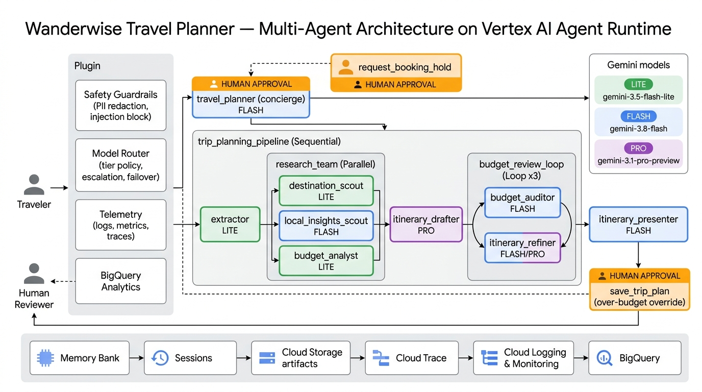
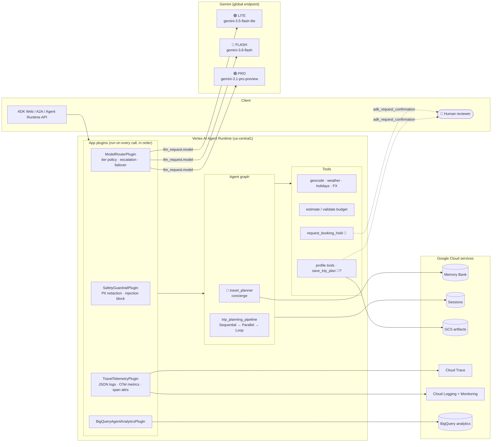
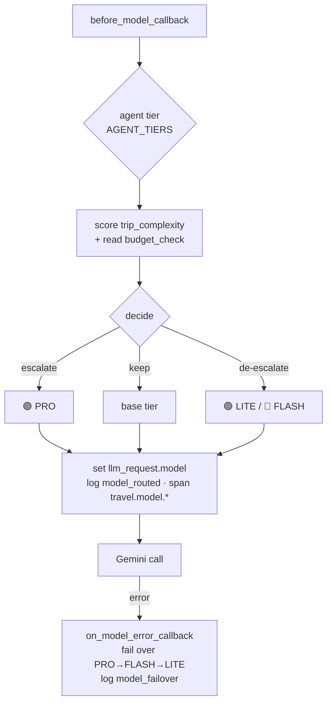
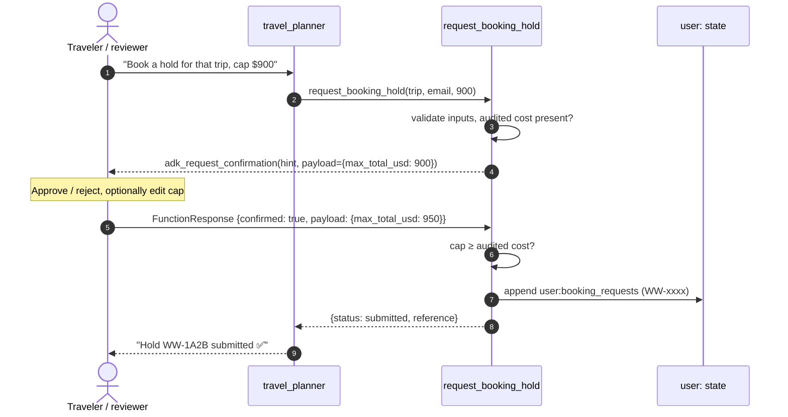

# Wanderwise — Architecture

## 1. Component view

## 2. Strategic model routing

| Agent | Base tier | Dynamic rule (in `routing.decide`) |
|---|---|---|
| `travel_planner` (concierge) | 🔵 FLASH | → 🟢 LITE for short small-talk turns with no tools needed |
| `trip_request_extractor` | 🟢 LITE | — (structured extraction) |
| `destination_scout` | 🟢 LITE | — (deterministic API lookups) |
| `budget_analyst` | 🟢 LITE | — (deterministic cost tool) |
| `local_insights_scout` | 🔵 FLASH | → 🟣 PRO if complexity ≥ 3 |
| `itinerary_drafter` | 🟣 PRO | → 🔵 FLASH for simple trips ≤ 2 days |
| `budget_auditor` | 🔵 FLASH | → 🟣 PRO if complexity ≥ 3 |
| `itinerary_refiner` | 🔵 FLASH | → 🟣 PRO if > 15 % over budget or complexity ≥ 2 |
| `itinerary_presenter` | 🔵 FLASH | → 🟣 PRO if complexity ≥ 3 |

`trip_complexity` adds one point each for: trip ≥ 7 days, party ≥ 5,
≥ 3 constraints, cost estimate > 90 % of budget (tight).

## 3. Human-in-the-loop checkpoints

The same mechanism guards `save_trip_plan`: when the budget loop ends **still
over budget**, `require_confirmation=needs_budget_override` pauses the save so
a human must explicitly accept the overspend. Unaudited saves are blocked
outright by the `require_budget_approval` policy callback.

All checkpoints emit `hitl_requested`, `hitl_approved`, `hitl_rejected`
audit events (structured logs → log-based metrics), with emails masked.
